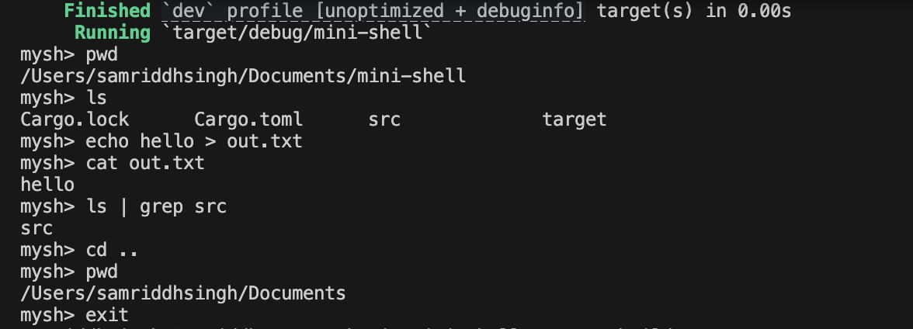

# Mini Unix Shell — `mysh` (Rust + nix)

A lightweight **Unix-like shell** written in **Rust**, demonstrating **low-level process control, I/O redirection, and interprocess communication** using the `nix` crate.

This project reimplements key components of how shells like **bash** or **zsh** work — including **forking**, **exec**, **pipes**, and **redirection** — entirely from scratch.

---

## Features

- Execute standard Unix commands (`ls`, `cat`, `grep`, etc.)
-  Handle **I/O redirection** (`>`, `<`)
-  Support for **simple pipes** (`|`)
-  Built-in commands: `cd`, `exit`
-  Error handling for invalid syntax or missing files
-  Minimal and clean Rust code using **nix** for system calls  

---

## Tech Stack

| Component | Purpose |
|------------|----------|
| **Rust** | Core language |
| **nix crate** | Provides POSIX syscall bindings (fork, exec, dup2, waitpid, pipe) |
| **Linux / macOS** | Unix-based OS target for testing |
| **C FFI (via CString/CStr)** | Used for safe command argument passing to `execvp()` |

---

## Architecture

The shell works in a **read–parse–execute loop**, similar to real shells:

1. Prompt → "mysh> "
2. Read user input (e.g., "ls -l | grep src > out.txt")
3. Tokenize input
4. Handle built-ins (cd, exit)
5. Parse redirections (<, >)
6. If a pipe exists (|), create a pipe() → fork twice → connect stdout/stdin using dup2()
7. For each process:
fork() → execvp() the command
8. Parent waits for children using waitpid()

---

## 🧩 Key System Concepts Demonstrated

* **Process creation** → via `fork()`
* **Program execution** → via `execvp()`
* **File descriptor manipulation** → via `dup2()`
* **Pipes** → for interprocess communication
* **Redirection** → input/output to files using open/close
* **Wait system call** → synchronizing parent and child processes

---

## Future Improvements

* Support **multiple pipes** (e.g., `cmd1 | cmd2 | cmd3`)
* Add background process support (`&`)
* Command history and line editing
* Environment variable expansion (`$PATH`)
* Support for signals (Ctrl+C, Ctrl+Z)
